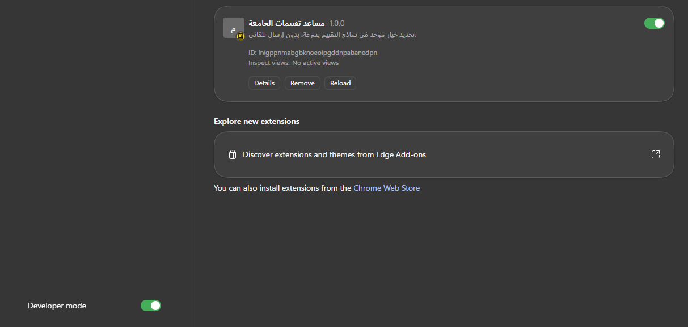
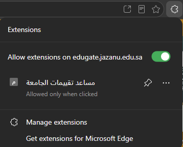
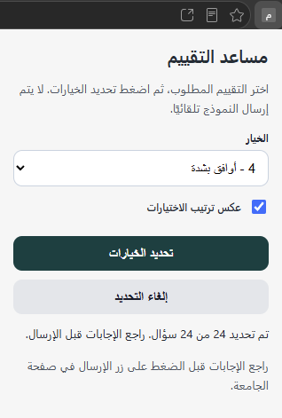

# University Evaluation Helper

University Evaluation Helper is a simple browser extension that helps university students quickly select the same rating option across evaluation forms.

The extension only selects the chosen option. It does **not** submit the form automatically. Always review your answers before submitting.

---

## Screenshots

### Extension installed in Microsoft Edge



### Allow the extension on the university website



### Load the extension using Developer Mode


### Extension popup while selecting answers



---

## Features

- Selects one rating option for all radio-button questions on the current evaluation page.
- Supports common rating scales:
  - `0 = Strongly Disagree`
  - `1 = Disagree`
  - `2 = Neutral`
  - `3 = Agree`
  - `4 = Strongly Agree`
- Works as an unpacked browser extension in Microsoft Edge, Google Chrome, and Firefox.
- Does not automatically submit the evaluation form.

---

## Project Structure

```text
README.md
.gitignore
LICENSE
manifest.json
assets/
  edge-extension-installed.png
  edge-site-permission.png
  load-unpacked-button.png
  extension-popup-arabic.png
src/
  popup.html
  popup.js
  styles.css
snippets/
  bookmarklet.txt
  console-snippet.js
```

---

## Installation Guide for Microsoft Edge or Google Chrome

### Step 1: Download or clone the project

Download the project as a ZIP file or clone it from GitHub.

If you downloaded the project as a ZIP file, extract it first.

Do **not** load the ZIP file directly into the browser. You must load the extracted folder.

---

### Step 2: Open the Extensions page

For Microsoft Edge, open:

```text
edge://extensions
```

For Google Chrome, open:

```text
chrome://extensions
```

---

### Step 3: Enable Developer Mode

Turn on **Developer mode**.

In Microsoft Edge, the Developer mode switch is usually at the bottom-left of the Extensions page.

In Google Chrome, the Developer mode switch is usually at the top-right of the Extensions page.

---

### Step 4: Load the extension

Click:

```text
Load unpacked
```

Then select the extracted project folder.

Make sure you select the folder that contains:

```text
manifest.json
```

After loading the folder, the extension should appear in the installed extensions list.

---

## Firefox Temporary Installation

Firefox uses a different method for testing unpacked extensions.

### Step 1: Open the Firefox debugging page

In Firefox, open:

```text
about:debugging#/runtime/this-firefox
```

---

### Step 2: Choose This Firefox

If you see a sidebar, click:

```text
This Firefox
```

---

### Step 3: Load the temporary add-on

Click:

```text
Load Temporary Add-on
```

---

### Step 4: Select the manifest file

Go to the extension project folder and select:

```text
manifest.json
```

After that, the extension should appear in Firefox.

> Note: In Firefox, this method installs the extension temporarily. If you close or restart Firefox, you may need to load it again.

---

## How to Pin the Extension

To access the extension easily:

1. Click the extensions icon in the browser toolbar.
2. Find the extension named **University Evaluation Helper** or **مساعد تقييمات الجامعة**.
3. Pin it to the toolbar if your browser supports pinning extensions.

---

## How to Use the Extension

### Step 1: Open the university evaluation page

Go to the university evaluation page that contains the evaluation questions.

Wait until the page fully loads.

---

### Step 2: Open the extension popup

Click the extension icon in the browser toolbar.

A small popup window will appear.

---

### Step 3: Choose the rating option

Select the rating option you want to apply to all questions.

The available options are:

```text
0 = Strongly Disagree
1 = Disagree
2 = Neutral
3 = Agree
4 = Strongly Agree
```

For example, if you want to select **Strongly Agree** for every question, choose:

```text
4 - Strongly Agree
```

---

### Step 4: Click the selection button

After choosing the rating option, click:

```text
Select Options
```

or, if the interface is in Arabic:

```text
تحديد الاختيارات
```

The extension will select the chosen option for all matching radio-button questions on the current page.

---

### Step 5: Review the answers

Before submitting the evaluation, review all selected answers manually.

Make sure the selected answers are correct.

---

### Step 6: Submit the form manually

After reviewing the answers, submit the evaluation from the university website.

The extension does **not** submit the form automatically.

---

## Troubleshooting

### The images do not appear in GitHub README

Make sure the image files are uploaded inside the `assets` folder and that the names match exactly:

```text
assets/edge-extension-installed.png
assets/edge-site-permission.png
assets/load-unpacked-button.png
assets/extension-popup-arabic.png
```

The image path in `README.md` must look like this:

```markdown

```

---

### The extension does not appear in the toolbar

Click the extensions icon in the browser toolbar and pin the extension.

---

### The extension does not select anything

Try the following:

1. Make sure you are on the evaluation page.
2. Refresh the evaluation page.
3. Wait until the page fully loads.
4. Open the extension again.
5. Choose the rating option.
6. Click the selection button again.

---

### The extension shows a Reload button on the Extensions page

Click:

```text
Reload
```

Then refresh the university evaluation page and try again.

---

### The browser says the extension is from another source

This is normal when loading an unpacked extension manually using Developer Mode.

---

## Important Notes

- This extension only selects answers.
- It does not submit the evaluation automatically.
- Always review your answers before submitting.
- Do not upload screenshots that contain private university information, student details, course numbers, or section numbers.
- Use the extension responsibly.

---

## License

This project is open source. You can update the license section based on the license file included in your repository.
